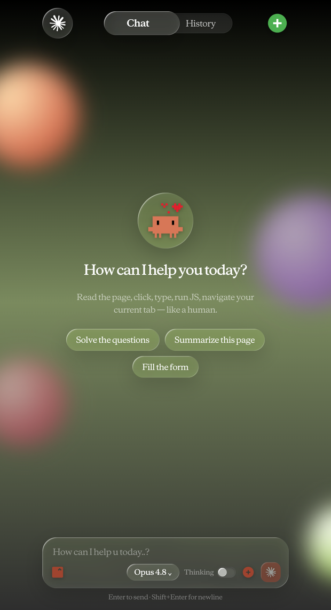
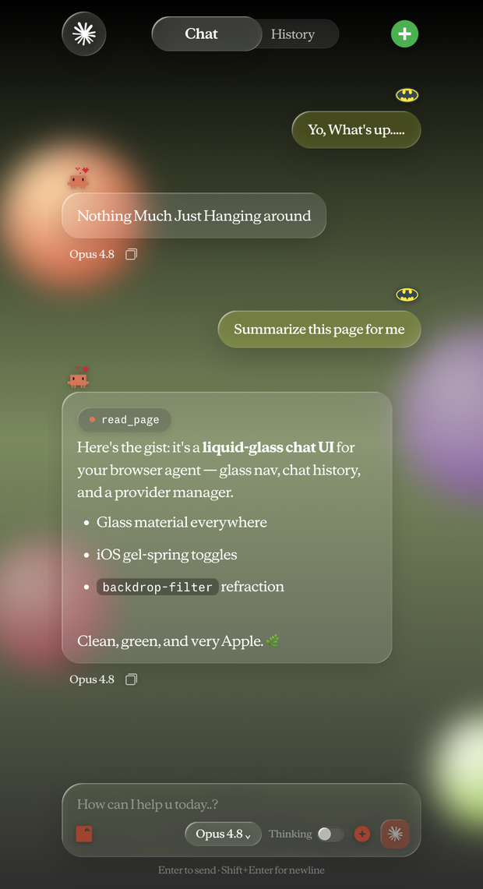
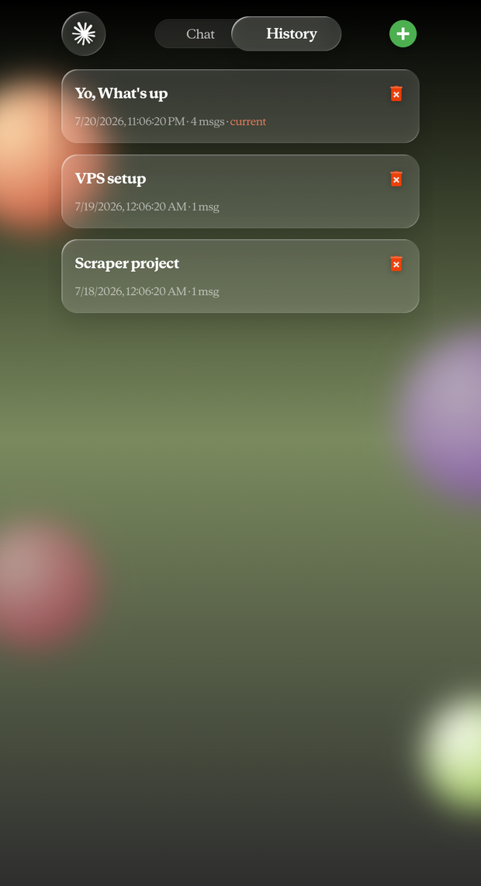
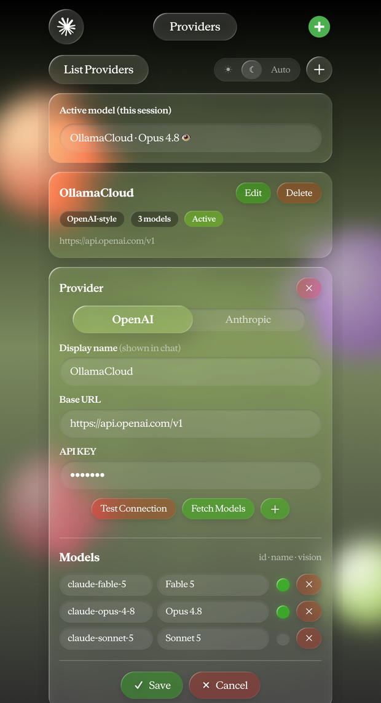

<div align="center">

# 🌿 NOCDP Browser Agent

**A Chrome extension that drives your browser like a human — no automation banner, no bot-detection trip, powered by your own API key.**

Reads pages · clicks · types · navigates · fills forms · records & replays flows · runs on a schedule — all from a **Liquid Glass** chat sidebar.

<sub>Anthropic's "Claude in Chrome" body · Antigravity's invisible hands · your key · a hand-built Apple-style UI</sub>

<br/>

[](../../releases/latest)
&nbsp;
[](https://chrome.google.com)
&nbsp;


<br/>

<table>
  <tr>
    <td width="25%"></td>
    <td width="25%"></td>
    <td width="25%"></td>
    <td width="25%"></td>
  </tr>
  <tr>
    <td align="center"><sub><b>New chat</b></sub></td>
    <td align="center"><sub><b>Conversation</b></sub></td>
    <td align="center"><sub><b>History</b></sub></td>
    <td align="center"><sub><b>Settings</b></sub></td>
  </tr>
</table>

</div>

---

## What it is

Most browser-automation tools (Puppeteer, Playwright, Selenium, the Chrome DevTools MCP) drive Chrome through the **Chrome DevTools Protocol** — they attach a debugger to the tab. That instantly raises the *"Chrome is being controlled by automated software"* banner and flips every signal a bot detector looks for. There is no quiet way to use CDP.

**This project never touches CDP for its default input.** The extension dispatches real `MouseEvent` / `KeyboardEvent` from a content script at page coordinates, captures the screen via `chrome.tabs.captureVisibleTab`, and evaluates JS via `chrome.scripting` — ordinary extension APIs that leave no automation trace. The result reads as **"Definitely a Human"** on `bot.sannysoft.com`, `pixelscan.net`, and `fingerprint.com` (webdriver `false`, suspect-score `0`).

It was built by reverse-engineering two extensions:

| Source | What was kept |
|--------|---------------|
| **Anthropic — "Claude in Chrome"** | the side panel + tool-execution engine (the *body*) |
| **Google — Antigravity Browser Extension** | the no-CDP control trick — real DOM events, never `chrome.debugger` (the *hands*) |

Anthropic's polished body + Antigravity's invisible hands, wearing a bespoke **Liquid Glass** interface, and thinking with **your** model.

---

## ✨ Highlights

- 🕵️ **Invisible control** — synthetic-but-real DOM events, no debugger banner, passes bot detection.
- 🧠 **Self-contained agent** — the tool-use loop runs *inside* the extension. Just load it, add a key, and chat. No local server, no install script, nothing running in the background.
- 🔑 **Bring your own key** — any OpenAI-style *or* Anthropic-style endpoint: OpenAI, Anthropic, OpenRouter, GLM, MiniMax, DeepSeek, Groq, Ollama (local/cloud), vLLM, LM Studio, and more. Multiple providers, switch the active one anytime.
- 🎬 **Procedures** — record a flow once, then replay it on demand or on a schedule. Choose **Macro** (exact deterministic replay, zero tokens) or **AI** (the agent follows your recording but adapts to page changes). Logins supported, with passwords encrypted by the vault.
- ⏰ **Scheduled tasks** — run any prompt on a timer (every N minutes or daily at a set time). Fires in a background window even when the panel is closed, as long as Chrome is open.
- 🔐 **Key vault** — encrypt provider API keys and recorded passwords at rest (AES-GCM + PBKDF2, 210k iterations). Unlock once per browser restart. Changing or disabling the vault *requires* the current passphrase.
- ⚡ **Auto-approve** — one toggle to let the agent run destructive actions (close tab, run JS, set/delete cookie) without pausing to ask.
- 💬 **Liquid Glass UI** — Apple-inspired frosted-glass side panel: gel-spring toggles, drifting glow orbs, real refraction (SVG displacement in `backdrop-filter`), Anthropic Serif Display type, true SSE token streaming, light + dark themes.
- 🖼️ **Vision-aware** — vision models get downscaled screenshots (image px == click coords); text-only models fall back to `read_page`, so every model works.
- 🛡️ **Trusted-mode fallback** — anti-cheat / exam sites that ignore synthetic events? A `real_*` tool set escalates to genuine `chrome.debugger` CDP (`isTrusted:true`) — used only on demand, with Chrome's debugger banner as the honest tell.
- 🔌 **MCP bridge** *(optional)* — expose the same browser to external clients (e.g. Claude Code) over stdio JSON-RPC, via the bundled local brain.

---

## 🚀 Install

### Option A — download the release (recommended)

1. Grab **`nocdp-browser-agent.zip`** from the [latest release](../../releases/latest) and unzip it.
2. Open `chrome://extensions` → toggle **Developer mode** on (top-right).
3. **Load unpacked** → select the unzipped `claude-ext/` folder.
4. Pin the extension and open the side panel (toolbar icon or **Cmd/Ctrl + E**).

> If the official "Claude" extension is installed, disable it first to avoid an extension-ID clash.

### Option B — from source

```bash
git clone https://github.com/SKgiet2021/Clau_Browser_Control.git
# chrome://extensions → Developer mode → Load unpacked → build/claude-ext/
```

### First run

Open the side panel → tap the **logo** (top-left) to open **Settings** → **PROVIDERS ＋ Add**:

- Choose **OpenAI** or **Anthropic** style (the toggle swaps the Base URL hint).
- Enter Base URL (with or without `/v1`) + API key → **Test Connection** → **Fetch Models**.
- Tick **vision** on models that support it → **✓ Save**.
- Back on **Chat**, pick the model from the input bar and start typing.

That's it — chat works with **nothing else running**.

---

## 🖥️ Settings, at a glance

The Settings page (logo, top-left) is organized into four sections:

| Section | What's there |
|---------|--------------|
| **Providers** | Add / edit endpoints, fetch models, pick the active provider. |
| **Automation** | **Scheduled tasks** and **Procedures** — record, schedule, and manage automations. |
| **Appearance** | Light / dark / system theme. |
| **Security** | **Auto-approve** toggle and the **Key encryption** vault. |

---

## 🎬 Procedures — record & replay

Teach the agent a flow once and have it run itself.

1. **Settings → Automation → Procedures → ＋**, give it a name and a start URL.
2. Pick a mode:
   - **Macro** — replays your exact recorded steps (clicks, typing, keys, scrolls, navigation). Deterministic, instant, **spends no tokens**.
   - **AI** — feeds your recording + a goal to the agent, which adapts if the page changed. Costs tokens, survives layout shifts.
3. Hit **● Record**, perform the flow in the real page, then **Stop & Save**.
4. Run it with **▶**, or set a **Schedule** (every N minutes / daily at a time).

**Logins** are supported — recorded password fields are flagged sensitive and encrypted with the vault (enable it first). Recording follows you across page navigations. *Limits:* no capture inside cross-origin iframes / shadow DOM (use AI mode), 2FA codes can't be replayed (record the post-login flow), and `chrome://` / Web Store pages can't be recorded.

---

## 🏗️ Architecture

```
┌───────────────────────────── Chrome ─────────────────────────────┐
│  Side panel  (build/claude-ext)                                   │
│                                                                   │
│   ├─ Liquid Glass chat UI — streaming, history, settings, themes  │
│   ├─ agent-core.js — the LLM tool-use loop, INSIDE the extension  │
│   │     └─ talks straight to YOUR provider (OpenAI/Anthropic API) │
│   ├─ No-CDP tool executor — content-script DOM events,            │
│   │     captureVisibleTab, chrome.scripting, cookies, webRequest  │
│   ├─ Procedures — record / macro-replay / AI-replay               │
│   ├─ Scheduler — chrome.alarms → background task & procedure runs │
│   └─ real_* CDP escalation, on demand only                        │
│                                                                   │
│  Local brain  (build/brain — OPTIONAL, for the MCP bridge only)   │
│   └─ mcp.js — stdio JSON-RPC so external clients (Claude Code)    │
│        can drive the same browser. Auto-spawned when launched.    │
└───────────────────────────────────────────────────────────────────┘
```

**The whole agent lives in the extension.** Chatting, procedures, and scheduled tasks need nothing running locally. The Node **brain** is now optional — it exists only to bridge the browser to external **MCP** clients.

### (Optional) drive from Claude Code

```json
"nocdp-browser": { "command": "node", "args": ["/abs/path/build/brain/mcp.js"] }
```

Keep the side panel open while an external client drives it.

---

## 🧰 Tools the agent can use

**Page perception** — `read_page`, `get_text`, `screenshot`
**Standard (stealth) interaction** — `click`, `type`, `press_key`, `scroll`
**Trusted interaction** *(escalates to CDP; shows debugger banner)* — `real_click`, `real_move`, `real_type`, `real_key`, `real_scroll`
**Navigation & tabs** — `navigate`, `list_tabs`, `new_tab`, `switch_tab`, `close_tab`
**Scripting** — `eval`
**Files** — `attached_file`, `upload_file` *(set a site's `<input type=file>` — e.g. upload a résumé)*
**DevTools** — `get_cookies`, `set_cookie`, `delete_cookie`, `list_network`, `get_network_request`, `set_request_header`, `block_url`, `clear_net_rules`

Every page tool accepts an optional `tabId` to target a specific tab.

---

## 🎨 The Liquid Glass UI

The side panel is a hand-written, framework-free UI (`sidepanel.js` string templates + `sidepanel.css`) implementing an Apple **Liquid Glass** material system designed in Figma:

- **Glass material** — `backdrop-filter: blur + saturate + url(#liquid-lens)` (an SVG `feDisplacementMap` for true edge refraction, Chrome-only, with a graceful frosted fallback) + specular rim lighting via inset shadows.
- **Motion** — an iOS gel-spring curve (`cubic-bezier(.32,1.72,.46,.9)`); segmented toggles slide with a squish-stretch "gel" keyframe.
- **Depth** — four drifting radial-gradient glow orbs float behind everything.
- **Type** — Anthropic Serif Display (bundled woff2), true SSE streaming with a live caret.
- **Chat** — Clawd + Batman avatars, glass message bubbles, an always-visible model-name + copy row under each reply.
- **Composer** — pie-ring context meter, region-snip (crop on the *real* page), file attach, per-message Thinking toggle, inline model picker.
- **Themes** — full dark + light, plus system-follow.

Icons are exported from the Figma prototype and shipped as PNGs in `build/claude-ext/figma-icons/`. A standalone reference prototype lives in `liquid-glass-demo/index.html`.

---

## 📁 Project layout

```
Extention_rev/
├── build/
│   ├── claude-ext/                # ← the extension you load
│   │   ├── manifest.json
│   │   ├── sidepanel.html/.js/.css  # Liquid Glass UI + no-CDP tool executor
│   │   ├── agent-core.js            # the agent LLM loop (runs in-extension)
│   │   ├── nocdp-shim.js            # neutralizes chrome.debugger by default (no banner)
│   │   ├── nocdp-actor.js           # content script: real DOM events, snip, recording
│   │   ├── nocdp-scheduler.js       # chrome.alarms → background task/procedure runs
│   │   ├── figma-icons/             # UI icons exported from the Figma prototype
│   │   └── assets/                  # Anthropic fonts + original tool engine
│   └── brain/                     # OPTIONAL — MCP bridge for external clients
│       ├── mcp.js                   # stdio MCP server (auto-spawns the relay)
│       ├── brain.js                 # legacy SSE+POST agent server (fallback)
│       └── start.sh / stop.sh / install.sh
├── liquid-glass-demo/             # standalone UI reference prototype (index.html)
├── docs/screenshots/              # README imagery
└── README.md
```

---

## 🔒 Security & responsible use

- **Keys & passwords** stay on-device in `chrome.storage.local`, never synced. Enable the **vault** to encrypt them at rest; changing or disabling it requires the current passphrase.
- **Auto-approve is off by default** — destructive tools prompt until you opt in. Scheduled/automated runs auto-approve by design (there's no one to ask).
- Built for **personal automation, accessibility, testing your own sites, and avoiding false-positive bot blocks on legitimate browsing** — with your own credentials and your own API key. It is not a scraping fleet, a credential-stuffing tool, or a generalized anti-detection service. Use it on sites and tasks you're authorized to automate.

---

## 🙏 Credits

Reverse-engineered from **Anthropic's "Claude in Chrome"** (side panel + tool engine) and **Google's Antigravity Browser Extension** (the no-CDP control approach). Reuses their bundled Anthropic Serif / Sans / Mono fonts and design tokens. The Liquid Glass interface was designed by the author in Figma and hand-ported into the panel; the reference prototype is in `liquid-glass-demo/`.
